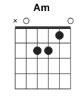
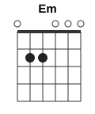
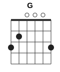

# La Anaconda

| | |
|---|---|
| Темп | ~108 BPM |
| Тональность (звучит) | Fm |
| Каподастр | 1-й лад (подобран по звуку под открытые аккорды) |
| Длительность | 4:41 |

## Аккорды

Формы указаны с учётом каподастра — так, как их держит левая рука.

  

| Аккорд | Лады (6→1) | Сколько звучит |
|---|---|---|
| **Am** | `x02210` | 151 с |
| **Em** | `022000` | 124 с |
| **G** | `320003` | 2 с |

## Последовательность

Основной квадрат (×24): **| Am | Am | Am | Am |**

По тактам (4/4, в строке 4 такта):

```
 0:01  | Am      | Am      | Am      | Am      |
 0:10  | Am      | Am      | Am      | Am      |
 0:18  | Am      | Em      | Em G    | G Am    |
 0:27  | Am      | Am      | Am      | Am      |
 0:36  | Am      | Am      | Am      | Am      |
 0:44  | Em      | Em      | Em      | Em Am   |
 0:53  | Am      | Am      | Am      | Am      |
 1:02  | Am      | Em      | Em      | Em      |
 1:11  | Em Am   | Am      | Am      | Am Em   |
 1:19  | Em      | Em      | Em      | Em      |
 1:28  | Em      | Em      | Em Am   | Am      |
 1:37  | Am      | Am      | Am      | Am      |
 1:46  | Am Em   | Em      | Em      | Am      |
 1:54  | Am      | Am      | Am      | Am      |
 2:03  | Am Em   | Em      | Em      | Am      |
 2:12  | Am      | Am      | Am Em   | Em      |
 2:21  | Em      | Em      | Em      | Em      |
 2:30  | Em      | Em Am   | Am      | Am      |
 2:38  | Am      | Am      | Am      | Am Em   |
 2:47  | Em      | Am      | Am      | Am      |
 2:56  | Am      | Am      | Am Em   | Em      |
 3:05  | Em      | Em      | Em      | Em      |
 3:13  | Em      | Em      | Em      | Em      |
 3:22  | Em      | Em      | Am      | Am      |
 3:31  | Am      | Am      | Am      | Am      |
 3:40  | Em      | Em      | Em      | Em Am   |
 3:48  | Am      | Am      | Am      | Em      |
 3:57  | Em      | Em      | Am      | Am      |
 4:06  | Am      | Em      | Em      | Em      |
 4:15  | Em      | Em      | Em      | Em      |
 4:23  | Em Am   | Am      | Am Em   | Em      |
 4:32  | Am      | Am      | —       | —       |
```

## Бой

Запись: **Д-ДВ Д-Д- Д-ДВ Д-Д-** (Д — вниз, В — вверх, «-» — рука проходит мимо струн)

```
Счёт:   1  е  и  а  2  е  и  а  3  е  и  а  4  е  и  а
Бой:    ↓  ·  ↓  ↑  ↓  ·  ↓  ·  ↓  ·  ↓  ↑  ↓  ·  ↓  ·
Акцент: >           >           >           >
```

Этот рисунок совпал в 51 из 125 тактов.

Рука двигается как маятник без остановок: вниз на счёт, вверх на «и». Там, где точка, рука всё равно делает движение, просто не задевает струны.

## Текст с аккордами

Аккорд стоит над словом, на котором его нужно сменить. Слева время в ролике. Текст распознан автоматически: в редких словах возможны ошибки.

```
       Am                     Em                                                                    Am
 0:39  Ay, viene el anaconda, canta el anaconda, canta el anaconda, y es la voz de mi abuelo, yagé, yagé

       Am
 0:59  (поют 17 с, слова не разобраны)

       Am                 Em                                                                                                                                        Am
 1:17  Vuelca a Ullarico, a Tumpaita, taquito, vuelca a Ullarico, a Tumpaita, muyurico, suena la maraca y el abuelo canta, suena la maraca y el abuelo danza, yagé, yagé

       Am                       Em                                             Am
 1:41  ahí, hagamos reverencia, que ya llegó el abuelo, poderoso abuelo, yagé, yagé

       Am                   Em                                           Am
 1:58  ay, casi ya resunció a tu taita chayamoku, sin cha tu taita yagé, yagé

       Am                 Em                                                                                                                                Am
 2:16  Vuelca a Ullarico, atunta y cataquico, vuelca a Ullarico, atunta y tamuyurico, suena la maraca y el abuelo canta, suena la maraca y el abuelo danza, yagé, yagé

       Am                          Em                           Am
 2:40  ahí, aquí está su medicina, poderosa medicina, para ver, para ver

       Am
 2:56  (поют 13 с, слова не разобраны)

       Em                                                                                                                                             Am
 3:10  Hualcaullarico, atuntaita, taquico, hualcaullarico, atuntaita, muyurico, suena la maraca y el abuelo canta, suena la maraca y el abuelo danza, yagé, yagé

       Am                            Em
 3:34  Ahí, contento está el abuelo, feliz está el abuelo, poderoso abuelo, yagé, yagé

       Am             Em                                                              Am
 3:50  Ay, crucícitos para tontaita, crucícitos para tontaita, cincha tontaita, yagé, yagé

       Em
 4:15  Suena la maraca y el abuelo danza

       Em      Am
 4:24  Ya que, ya que

```

## Слух против зрения

Видеоанализ не запускался (нет `ANTHROPIC_API_KEY` или видео). Аккорды и бой — только по звуку.

## Как выучить

1. Поставьте аккорды Am, Em, G и переставляйте их по кругу без ритма, пока смена не станет занимать меньше доли.
2. Бой «Д-ДВ Д-Д- Д-ДВ Д-Д-» сначала на одном заглушённом аккорде, под метроном 75 BPM.
3. Соедините: квадрат + бой на медленном темпе, затем поднимайте до 108 BPM.
4. Играйте вместе с видео — на сменах частей слушайте, где бой меняется.

---
_Разбор собран автоматически: звук — librosa (хрома + Витерби, онсеты), видео — Claude (формы аккордов, каподастр) и OpenCV (движение правой руки). Проверяйте на слух, особенно редкие аккорды._