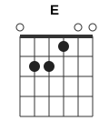

# La Anaconda: разбор для гитары

Видео: Nicolas Losada & Erika Muchavisoy, La Anaconda (EN VIVO, cover), Música Medicina

Песня держится на двух аккордах и одном бое, поэтому подходит для первых месяцев игры. Сложность только в том, чтобы менять аккорды вовремя: гитара идёт за голосом, а не по ровному счёту. Ниже весь текст с отметками, где менять.

## Коротко

| | |
|---|---|
| Каподастр | **1-й лад**, его видно на видео у самого порожка |
| Аккорды | **Am** и **Em**, по желанию ещё **E** |
| Бой | восьмые: **↓ ↑ ↓ ↑ ↓ ↑ ↓ ↑**, вниз громко, вверх легко |
| Темп | ~108 ударов в минуту |
| Длительность | 4:41, гитара звучит с первой секунды до 4:33 |

Если каподастра нет, играйте те же формы без него. Будет на полтона ниже записи, петь под это можно спокойно.

## Аккорды

  

Лады отсчитываются от каподастра: «1-й лад» значит первый лад после каподастра.

**Am** (`x02210`): 6-ю струну не играем.
- указательный: 2-я струна, 1-й лад;
- средний: 4-я струна, 2-й лад;
- безымянный: 3-я струна, 2-й лад.

**Em** (`022000`): все шесть струн.
- средний: 5-я струна, 2-й лад;
- безымянный: 4-я струна, 2-й лад.

Удобный переход Am → Em: средний палец с 4-й струны уходит на 5-ю, безымянный с 3-й на 4-ю, указательный просто поднимается. Рука сдвигается на одну струну вверх, к басам, как единая «лопатка».

**E** (`022100`, по желанию): это Em плюс указательный на 3-й струне, 1-й лад. Звучит ярче и сильнее тянет обратно в Am. В припевах на записи местами слышится именно он, но разница с Em на грани точности анализа. Начните с Em, а когда освоитесь, попробуйте E перед возвратом в Am и решите на слух.

## Бой

Каждая доля делится на два удара: вниз на счёт, вверх на «и».

```
Счёт:    1   и   2   и   3   и   4   и
Рука:    ↓   ↑   ↓   ↑   ↓   ↑   ↓   ↑
Сила:    >       >       >       >
```

- **Вниз** на каждый счёт бьёте увереннее, по всем струнам аккорда.
- **Вверх** легко цепляете 3–4 верхние (тонкие) струны. На записи удары вверх вдвое тише ударов вниз.
- Рука не останавливается, это маятник. Вниз и вверх уходит одна доля, примерно полсекунды.

Этот бой не меняется всю песню, от вступления до конца. Меняется только громкость: первые ~37 секунд гитара играет тихо, примерно вдвое тише остальной песни.

Как разучить:
1. Только удары вниз на счёт 1-2-3-4 на заглушённых струнах под метроном 80.
2. Добавьте лёгкие удары вверх: ↓↑↓↑↓↑↓↑.
3. То же на Am, потом на Em. Каждые 4 счёта меняйте аккорд.
4. Поднимайте метроном до 108.

## Структура

| Время | Часть | Что играть |
|---|---|---|
| 0:00–0:39 | Вступление (кадры с дрона) | тихий бой; Am, около 0:21 пару тактов Em, потом снова Am |
| 0:39 | Куплет 1 | Am → Em → Am |
| 1:17 | Припев 1 | Am ↔ Em быстро |
| 1:41 | Куплет 2 | Am → Em → Am |
| 2:16 | Припев 2 | Am ↔ Em быстро |
| 2:40 | Куплет 3 | Am → Em → Am |
| 3:10 | Припев 3 | Am ↔ Em быстро |
| 3:34 | Куплет 4 | Am → Em → Am |
| 4:07 | Финальный припев | Am ↔ Em быстро |
| 4:28–4:33 | Концовка | Am и последний удар вниз на Am около 4:33, дать прозвенеть |

Длинных проигрышей между частями нет: пауза в голосе 1–3 секунды, гитара при этом продолжает бой на Am.

Во вступлении с 0:18 до 0:30 по звуку проскакивают ещё какие-то аккорды, но разобрать их уверенно не получилось. Играйте там Am, это не будет мешать.

## Два правила смены аккордов

Всю песню можно играть по двум правилам.

**Куплет.** Строка начинается на **Am**. Примерно с середины строки, когда мелодия повторяет первую фразу, идёт **Em**. На «yagé, yaje» в конце строки возврат в **Am**.

**Припев.** На словах «Huasca…» и «Suena la maraca…» играем **Am**, на «…atuntaita…» и «…el abuelo canta/danza» играем **Em**. Финальное «yagé, yaje» снова на **Am**.

## Текст с аккордами

Аккорд стоит над словом, на котором его нужно сменить. Слева время в ролике.

Песня на испанском со словами на языке инга (taita, yagé, atuntaita, huasca и др.). Слова распознаны автоматически по голосу, без опоры на готовый текст. Испанские строки разобрались хорошо, а написание слов на инга приблизительное: сверяйтесь со слухом.

```
— ВСТУПЛЕНИЕ (0:00–0:39) —
       Am                                   Em      Am
0:00  (тихий бой ↓↑↓↑ …)  ……………………  0:21 ……  0:24 ……

— КУПЛЕТ 1 —
       Am                     Em
0:39  Ay, viene el anaconda, canta el anaconda, canta el
       Em                                        Am
0:48  anaconda, y es la voz de mi abuelo, yagé, yaje

       Am                            Em               Am
0:59  (вторая строка куплета, слова не разобраны) 1:04 … 1:12 …

— ПРИПЕВ 1 —
       Am                Em                Am
1:17  Huasca, uyaricua, tumpa y tatakitu, huasca, uyaricua,
       Em
1:23  tumpa y tamuyuritu,
       Am              Em        Am     Em          Am
1:26  suena la maraca y el abuelo … danza, yagé, yaje
      (распознана одна строка; по длительности здесь, как и в
       других припевах, скорее всего две: «…canta» и «…danza»)

— КУПЛЕТ 2 —
       Am                     Em
1:41  Ay, hagamos reverencia que ya llegó el abuelo, poderoso
       Em            Am
1:51  abuelo, yagé, yaje

       Am                     Em
1:58  Ay, casillari, sunchi, atuntaita, chayamoku, sinchi,
       Em               Am
2:08  atuntaita, yagé, yaje

— ПРИПЕВ 2 —
       Am               Em                  Am
2:16  Huasca, uyarico, atuntaita, taquico, huasca, uyarico,
       Em                   Am              Em
2:22  atuntaita, muyurico, suena la maraca y el abuelo canta,
       Am              Em                 Am
2:29  suena la maraca y el abuelo danza, yagé, yaje

— КУПЛЕТ 3 —
       Am                          Em
2:40  Ahí, aquí está su medicina, poderosa medicina, para
       Em   Am
2:49  ver, para ver

       Am                              Em
2:55  Ay, caipicampay, pambi, huasca, sinchi, ambi, huasca,
       Em        Am
3:04  gawangra, gawangra

— ПРИПЕВ 3 —
       Am              Em                  Am
3:10  Hualcaullarico, atuntaita, taquito, hualcaullarico,
       Em                   Am              Em
3:16  atuntaita, muyurico, suena la maraca y el abuelo canta,
       Am              Em                 Am
3:23  suena la maraca y el abuelo danza, yagé, yaje

— КУПЛЕТ 4 —
       Am                            Em
3:34  Ahí, contento está el abuelo, feliz está el abuelo,
       Em                     Am
3:42  poderoso abuelo, yagé, yaje

       Am             Em
3:50  Ay, crucícitos para tontaita, crucícitos para tontaita,
       Em                       Am
3:59  sinchi a tontaita, yagé, yaje

— ФИНАЛЬНЫЙ ПРИПЕВ —
       Am             Em                  Am
4:07  Hualcaullarico a tontaita taquito, hualcaullarico
       Em
4:12  a tontaita muyurico,
       Am              Em                     Am
4:15  suena la maraca y el abuelo canta, suena la maraca
       Em                 Am
4:21  y el abuelo danza, yagé, yagé

— КОНЦОВКА —
       Am                              Am
4:28  (бой на Am ……………)   4:33  ↓ последний удар, пусть звенит
```

В припевах там, где стоит Em прямо перед финальным Am («…el abuelo danza»), можно играть E: на записи это место звучит ближе всего к нему.

## Как я это проверял

| Что | Чем | Результат |
|---|---|---|
| Каподастр | глазами по кадрам 0:47, 0:57, 3:05–3:14 | 1-й лад, виден чётко |
| Аккорды | по звуку гитары, отделённой от голоса (Demucs) | Am и Em. Am/C и E/Em путал голос; без голоса C пропал, E остался под вопросом |
| Позиция левой руки | глазами, выборочные кадры | на всех просмотренных кадрах рука у 1–2 лада от каподастра, баррэ нет |
| Бой | удары по звуку + движение правой руки на видео (OpenCV) | рука делает полный цикл вниз-вверх за 0,54 с, это ровно одна доля; удары каждые 0,26 с, то есть восьмые |
| Сила ударов | звук | вниз ~1,5, вверх ~0,5–0,9 (условные единицы) |
| Текст | Whisper large-v3 по отделённому голосу | испанский разобран, слова на инга примерно, строка на 0:59–1:17 не разобрана |

Чего проверить не удалось. Видео в 480p: на нём видно, где стоит рука, но не видно, Em это или E (разница в один палец). Если найдёте версию в 1080p, прогоню её ещё раз.
