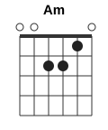
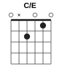

# La Anaconda: разбор для гитары

Видео: Nicolas Losada & Erika Muchavisoy, La Anaconda (EN VIVO, cover), Música Medicina

Версия 3. Первые две ошиблись в бое и во втором аккорде, и это заметили по рукам на видео. Здесь всё пересчитано по чистой гитаре: голос отделён нейросетью Demucs, затем по каждой струне посчитано, на каком ладу она звучит, и проверено по кадрам.

## Коротко

| | |
|---|---|
| Каподастр | **1-й лад** |
| Аккорды | **Am** и **C/E**. Отличаются одним пальцем, безымянным |
| Бой | сан-хуанито: **↓ · ↓ ↑ ↓ · Б✕ ·**, где Б✕ — бас на 6-й струне и «чик» левой рукой |
| Темп | ~108 ударов в минуту |
| Длительность | 4:41, гитара звучит с первой секунды до 4:33 |

## Аккорды: левая рука почти не двигается

 

Лады считаются от каподастра.

**Am** (`002210`): бьём все шесть струн, 6-я открытая тоже звучит.
- указательный: 2-я струна, 1-й лад;
- средний: 4-я струна, 2-й лад;
- безымянный: 3-я струна, 2-й лад.

**C/E** (`0x2010`, до мажор с басом ми): **тот же Am, только безымянный поднят**. 3-я струна звучит открытой.
- указательный и средний остаются на месте;
- 5-я струна в этом аккорде на записи не звучит. Средний палец, который стоит на 4-й струне, слегка ложится подушечкой на 5-ю и глушит её.

Вся гармония песни держится на одном движении: **безымянный опускается на 3-ю струну (Am) и поднимается (C/E)**. Указательный и средний всю песню стоят на месте.

Новичку: если глушить 5-ю струну пока не выходит, играйте C/E без 6-й и 5-й, бейте от 4-й струны вниз. Звучать будет похоже.

> **Почему не Em, как было в первых версиях.** По общей записи эти два аккорда легко спутать: в C/E и Em две общие ноты, и в обоих в басу ми. По чистой гитаре видно точно: на 2-й струне звучит до (1-й лад), а не открытая си; 5-я струна молчит; на 3-й открытая соль. Это C/E. Соль-диеза (E мажор) нет нигде.

## Бой: сан-хуанито с басом и «чиком»

Играется пальцами, без медиатора. Правая рука ходит маятником в два раза быстрее счёта, без остановок: вниз-вверх-вниз-вверх на каждую четверть доли. Часть движений проходит мимо струн.

```
Счёт:   1    е    и    а  │  2    е    и    а
Рука:   ↓    ↑    ↓    ↑  │  ↓    ↑    ↓    ↑
Звук:   ↓    ·    ↓    ↑  │  ↓    ·    Б✕   ·
        всё,      тихо тихо  от 5-й     бас +
        с басом              струны     «чик»
```

На слух: **ТА — та-та | ТА — БУМ-чик —**. На «3–4» повторяется то же самое.

- **«1»**: громкий удар вниз по всем шести струнам, с басом.
- **«и» и «а» после единицы**: лёгкие удары вниз и вверх по верхним струнам.
- **«2»**: громкий удар вниз, но **начиная с 5-й струны**, 6-ю не задеваем.
- **«и» после двойки (Б✕)**: бьём **басовую 6-ю струну**, и в этот же момент **пальцы левой руки отпускают струны**: остаются на них, но не прижимают. Аккорд обрывается, звучат бас и глухой щелчок. Это то самое «поднимает и опускает палец».
- На следующую «1» пальцы снова прижимают аккорд.
- В точках «·» правая рука движется, но струн не касается.

Бой одинаковый от вступления до конца. Первые ~37 секунд гитара просто тише.

Как разучить:
1. Заглушите струны левой рукой и ведите правой маятник ↓↑↓↑ без остановок, проговаривая «раз-и-и-а, два-и-и-а». Метроном 60.
2. На маятнике бейте только «РАЗ» (все струны) и «ДВА» (от 5-й).
3. Добавьте лёгкие «и-а» после раза: «РАЗ-и-а, ДВА».
4. Отдельно на Am: «ДВА», потом бас на 6-й и одновременно ослабить пальцы левой руки, «БУМ-чик». Затем снова прижать на «РАЗ».
5. Соедините: «РАЗ-и-а, ДВА-БУМчик», потом со сменой Am ↔ C/E. Поднимайте до 108.

## Структура

| Время | Часть | Аккорды |
|---|---|---|
| 0:00–0:39 | Вступление (кадры с дрона) | тихий бой, в основном Am, около 0:19–0:29 несколько коротких C/E |
| 0:39 | Куплет 1 | Am → C/E → Am |
| 1:17 | Припев 1 | Am ↔ C/E каждый такт |
| 1:41 | Куплет 2 | Am → C/E → Am |
| 2:16 | Припев 2 | Am ↔ C/E каждый такт |
| 2:40 | Куплет 3 | Am → C/E → Am |
| 3:10 | Припев 3 | Am ↔ C/E каждый такт |
| 3:34 | Куплет 4 | Am → C/E → Am |
| 4:07 | Финальный припев | Am ↔ C/E каждый такт |
| 4:28–4:33 | Концовка | Am, последний удар вниз около 4:33, дать прозвенеть |

## Два правила смены

**Куплет.** Строка начинается на **Am** (безымянный стоит). С середины строки идёт **C/E** (безымянный поднят), 3–4 такта. На «yagé, yaje» в конце строки безымянный опускается, снова **Am**.

**Припев.** Безымянный «шагает» каждый такт: «Huasca… / Suena la maraca…» на **Am**, «…atuntaita… / …el abuelo canta/danza» на **C/E**. Финальное «yagé, yaje» на **Am**.

## Текст с аккордами

Аккорд стоит над словом, на котором его нужно сменить. Слева время в ролике.

```
— ВСТУПЛЕНИЕ (0:00–0:39) —
       Am                                   C/E     Am
0:00  (тихий бой ↓↑↓↑ …)  ……………………  0:21 ……  0:24 ……

— КУПЛЕТ 1 —
       Am                     C/E
0:39  Ay, viene el anaconda, canta el anaconda, canta el
       C/E                                       Am
0:48  anaconda, y es la voz de mi abuelo, yagé, yaje

       Am                            C/E              Am
0:59  (вторая строка куплета, слова не разобраны) 1:04 … 1:12 …

— ПРИПЕВ 1 —
       Am                C/E               Am
1:17  Huasca, uyaricua, tumpa y tatakitu, huasca, uyaricua,
       C/E
1:23  tumpa y tamuyuritu,
       Am              C/E       Am     C/E         Am
1:26  suena la maraca y el abuelo … danza, yagé, yaje
      (распознана одна строка; по длительности здесь, как и в
       других припевах, скорее всего две: «…canta» и «…danza»)

— КУПЛЕТ 2 —
       Am                     C/E
1:41  Ay, hagamos reverencia que ya llegó el abuelo, poderoso
       C/E           Am
1:51  abuelo, yagé, yaje

       Am                     C/E
1:58  Ay, casillari, sunchi, atuntaita, chayamoku, sinchi,
       C/E              Am
2:08  atuntaita, yagé, yaje

— ПРИПЕВ 2 —
       Am               C/E                 Am
2:16  Huasca, uyarico, atuntaita, taquico, huasca, uyarico,
       C/E                  Am              C/E
2:22  atuntaita, muyurico, suena la maraca y el abuelo canta,
       Am              C/E                Am
2:29  suena la maraca y el abuelo danza, yagé, yaje

— КУПЛЕТ 3 —
       Am                          C/E
2:40  Ahí, aquí está su medicina, poderosa medicina, para
       C/E  Am
2:49  ver, para ver

       Am                              C/E
2:55  Ay, caipicampay, pambi, huasca, sinchi, ambi, huasca,
       C/E       Am
3:04  gawangra, gawangra

— ПРИПЕВ 3 —
       Am              C/E                 Am
3:10  Hualcaullarico, atuntaita, taquito, hualcaullarico,
       C/E                  Am              C/E
3:16  atuntaita, muyurico, suena la maraca y el abuelo canta,
       Am              C/E                Am
3:23  suena la maraca y el abuelo danza, yagé, yaje

— КУПЛЕТ 4 —
       Am                            C/E
3:34  Ahí, contento está el abuelo, feliz está el abuelo,
       C/E                    Am
3:42  poderoso abuelo, yagé, yaje

       Am             C/E
3:50  Ay, crucícitos para tontaita, crucícitos para tontaita,
       C/E                      Am
3:59  sinchi a tontaita, yagé, yaje

— ФИНАЛЬНЫЙ ПРИПЕВ —
       Am             C/E                 Am
4:07  Hualcaullarico a tontaita taquito, hualcaullarico
       C/E
4:12  a tontaita muyurico,
       Am              C/E                    Am
4:15  suena la maraca y el abuelo canta, suena la maraca
       C/E                Am
4:21  y el abuelo danza, yagé, yagé

— КОНЦОВКА —
       Am                              Am
4:28  (бой на Am ……………)   4:33  ↓ последний удар, пусть звенит
```
Песня на испанском со словами на языке инга. Слова распознаны автоматически (Whisper) по отделённому голосу: испанские строки надёжны, написание слов на инга примерное.

## Как проверял

| Что | Чем | Результат |
|---|---|---|
| Каподастр | кадры 0:47, 0:57, 3:05–3:14 | 1-й лад |
| Какие струны и на каком ладу | спектр чистой гитары (Demucs), основной тон каждой струны в момент удара | Am: `002210`. Второй аккорд: 6-я открытая, 5-я молчит, 4-я на 2-м ладу, 3-я открытая, 2-я на 1-м, 1-я открытая, то есть C/E |
| Смена аккордов | 3-я струна, 2-й лад или открытая, на каждом полутакте всей песни | Am и C/E чередуются по куплетам и припевам, E мажора нет нигде |
| Бой | сила ударов на каждой шестнадцатой, среднее по 106 тактам + правая рука по кадрам | ↓ · ↓ ↑ ↓ · Б✕ · всю песню |
| Бас и «чик» на «2-и» | громкость отдельных струн до и после удара | 6-я басовая струна: в 23 раза громче, чем после «2» (её бьют именно здесь); зажатая 4-я глохнет в 100 раз (пальцы отпустили); открытая 1-я стихает лишь вдвое, то есть глушит левая рука, а не ладонь |

Что осталось неточным:
- В припевах, где аккорды меняются каждый такт, на 2-й струне до и си звучат примерно поровну. Возможно, там иногда поднимается и указательный. Начните с варианта выше.
- Вступление 0:00–0:30 тихое, смены там распознаются хуже.
- Видео в 480p: на нём видно позицию и движение пальцев, но не отдельные струны. Струны определены по звуку.

Гитара без голоса для игры вместе: [guitar.ogg](guitar.ogg); голос без гитары: [vocals.ogg](vocals.ogg).
